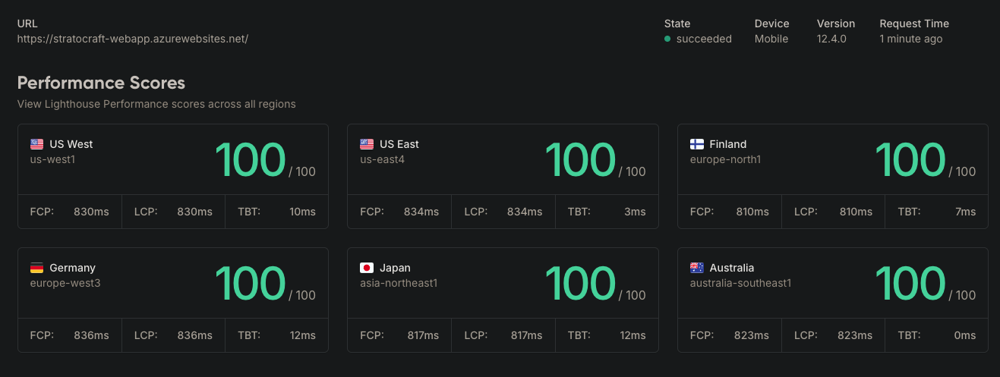

# stratocraft.dev

A modern, high-performance blog built with Go, Templ templates, and Tailwind CSS. Features real-time search, GitHub-based content management, and automatic post updates via webhooks.

You can give the live site a spin at <a href="https://stratocraft.dev" target="_blank">stratocraft.dev</a>

## ⚡ Performance First

Designed and optimized for exceptional web performance:

🏆 **100 Lighthouse Score** for Performance when deployed to Azure App Service.




## 🚀 Features

- **Modern Go Stack**: Go 1.24 + Echo v4 + Templ templates + Tailwind CSS v4
- **GitHub Content Management**: Posts stored as Markdown in GitHub repository
- **Real-time Search**: HTMX-powered search with tag and title filtering
- **Webhook Auto-Updates**: Automatically refreshes content when posts are added to GitHub
- **Responsive Design**: Mobile-first design with dark/light mode support
- **Syntax Highlighting**: Code blocks with tokyo-night theme
- **SEO Optimized**: Structured data, meta tags, and semantic HTML
- **Production Ready**: Docker containerization for Azure deployment

## 🏗️ Architecture

```
┌─────────────────┐    ┌──────────────────┐    ┌─────────────────┐
│   GitHub Posts  │    │   stratocraft.dev│    │   GitHub        │
│   Repository    │───▶│   Application    │◀───│   Webhook       │
│   (Markdown)    │    │   (Go + Templ)   │    │   (Auto-refresh)│
└─────────────────┘    └──────────────────┘    └─────────────────┘
         │                       │                       │
         ▼                       ▼                       ▼
┌─────────────────┐    ┌──────────────────┐    ┌─────────────────┐
│   Content API   │    │   Azure          │    │   Real-time     │
│   (GitHub API)  │    │   App Service    │    │   Search        │
│                 │    │   (Containers)   │    │   (HTMX)        │
└─────────────────┘    └──────────────────┘    └─────────────────┘
```

## 🛠️ Technology Stack

**Backend:**
- Go 1.24 with Echo v4 framework
- Templ for type-safe HTML templates
- GitHub API for content management
- HTMX for dynamic interactions

**Frontend:**
- Tailwind CSS v4 for styling
- Vanilla JavaScript for theme switching
- Highlight.js for syntax highlighting
- Responsive design with mobile navigation

**Infrastructure:**
- Docker for containerization
- Azure App Service for hosting
- Azure Container Registry for image storage
- GitHub webhooks for automatic updates

## 📁 Project Structure

```
stratocraft.dev/
├── docs/
│   ├── azure-deployment-guide.md            # Azure App Service deployment guide
│   ├── webhook-setup-guide.md               # GitHub webhook setup
│   └── github-token-setup-guide.md          # GitHub token configuration
├── internal/
│   ├── application/                        # HTTP handlers
│   │   ├── home.go                         # Home page handler
│   │   ├── posts.go                        # Posts listing handler
│   │   ├── post.go                         # Individual post handler
│   │   ├── search.go                       # Search functionality
│   │   ├── about.go                        # About page handler
│   │   └── webhook.go                      # GitHub webhook handler
│   ├── contentmanager/                     # GitHub integration
│   │   ├── contentmanager.go               # Content fetching logic
│   │   └── parsemarkdown.go                # Markdown parsing
│   ├── views/
│   │   ├── pages/                          # Page templates
│   │   ├── components/                     # Reusable components
│   │   └── shared/                         # Layout and navigation
│   └── site/                               # Site configuration
├── public/
│   ├── css/                                # Stylesheets
│   ├── js/                                 # JavaScript files
│   └── img/                                # Images and assets
├── scripts/
│   ├── deploy-azure-appservice.sh          # Azure App Service deployment
│   ├── run-dev.sh                          # Development orchestration
│   ├── templ-watch.sh                      # Template hot reloading
│   ├── tailwind-watch.sh                   # CSS hot reloading
│   └── test-webhook.sh                     # Webhook testing
├── server/
│   └── main.go                             # Application entry point
├── Dockerfile                              # Container configuration
├── package.json                            # Tailwind CSS dependencies
└── README.md                               # This file
```

## 🚀 Quick Start

### Prerequisites

- Go 1.24+
- Docker (for deployment)
- Node.js (for Tailwind CSS)
- GitHub Personal Access Token ([setup guide](docs/github-token-setup-guide.md))

### Local Development

1. **Clone the repository**
   ```bash
   git clone https://github.com/stratocraft/stratocraft.dev.git
   cd stratocraft.dev
   ```

2. **Install dependencies**
   ```bash
   go mod download
   go install github.com/a-h/templ/cmd/templ@latest
   go install github.com/cosmtrek/air@latest
   npm install
   ```

3. **Set environment variables**
   ```bash
   export GITHUB_TOKEN=your_github_token_here  # See: docs/github-token-setup-guide.md
   export GITHUB_WEBHOOK_SECRET=$(openssl rand -hex 32)  # Optional
   ```

4. **Start development environment**
   
   **Option A: All-in-One Script (Recommended)**
   ```bash
   ./scripts/run-dev.sh
   ```
   
   This single command:
   - ✅ Checks prerequisites and environment
   - ✅ Runs initial builds
   - ✅ Starts Tailwind CSS watch (background)
   - ✅ Starts Templ template watch (background)  
   - ✅ Starts Air Go hot reload (foreground)
   - ✅ Provides proper cleanup on Ctrl+C
   
   **Additional commands:**
   ```bash
   ./scripts/run-dev.sh stop      # Stop all processes
   ./scripts/run-dev.sh restart   # Restart all processes
   ./scripts/run-dev.sh status    # Show process status
   ```
   
   **Option B: Manual Setup (Advanced)**
   
   If you prefer to run each process manually in separate terminals:
   
   **Terminal 1 - Templ Watch:**
   ```bash
   ./scripts/templ-watch.sh
   ```
   
   **Terminal 2 - Tailwind Watch:**
   ```bash
   ./scripts/tailwind-watch.sh
   ```
   
   **Terminal 3 - Go Server with Air:**
   ```bash
   air
   ```

5. **Visit** http://localhost:8080

   The application will automatically reload when you make changes to:
   - Go files (via Air)
   - Templ templates (via templ-watch.sh)
   - CSS styles (via tailwind-watch.sh)

## 🌐 Deployment to Azure

Deploy to Azure App Service for Containers for the best web application experience:

### App Service Deployment (~$13-15/month)
```bash
export GITHUB_TOKEN=your_token
export GITHUB_WEBHOOK_SECRET=your_webhook_secret
./scripts/deploy-azure-appservice.sh
```

**Why App Service:**
- ✅ Always-on web application (no cold starts)
- ✅ Built-in SSL certificates and load balancing
- ✅ Easy custom domain configuration
- ✅ Integrated CI/CD with auto-deployment
- ✅ Better cost efficiency for 24/7 workloads
- ✅ Built-in health monitoring and auto-restart

📖 **Detailed Instructions**: See [Azure Deployment Guide](docs/azure-deployment-guide.md) for complete setup instructions and configuration options.

## 🔄 GitHub Webhook Setup

Enable automatic content updates when you add new blog posts:

1. Generate a webhook secret: `openssl rand -hex 32`
2. Configure the webhook in your GitHub posts repository
3. Set the webhook URL to: `https://yourdomain.com/webhook/github`

📖 **Detailed Instructions**: See [Webhook Setup Guide](docs/webhook-setup-guide.md) for step-by-step configuration.

## ✨ Key Features

### Content Management
- **GitHub Integration**: Posts stored as Markdown files in a separate GitHub repository
- **Automatic Refresh**: Webhook-triggered content updates without server restarts
- **Frontmatter Support**: YAML frontmatter for post metadata (title, date, tags, etc.)

### Search & Navigation
- **Real-time Search**: HTMX-powered search across post titles and tags
- **Posts Listing**: Paginated view of all posts, sorted by date
- **Individual Post Pages**: Clean, readable post layout with syntax highlighting
- **Mobile Navigation**: Hamburger menu with smooth animations

### Performance & SEO
- **Fast Loading**: Optimized Docker images and efficient Go backend
- **Syntax Highlighting**: Code blocks with tokyo-night-dark theme
- **Dark/Light Mode**: Automatic theme detection with manual toggle
- **Responsive Design**: Mobile-first approach with Tailwind CSS

## 🔧 Configuration

### Environment Variables

**Required:**
- `GITHUB_TOKEN`: Personal access token for GitHub API access ([setup guide](docs/github-token-setup-guide.md))

**Optional:**
- `GITHUB_WEBHOOK_SECRET`: Secret for webhook signature verification
- `PORT`: Server port (default: 8080)

### Site Configuration

Edit `internal/site/site.go` to configure:
- Post repository owner and name
- Site metadata and branding
- Navigation links

## 📝 Content Management

### Adding Blog Posts

1. **Create a Markdown file** in your posts repository
2. **Add frontmatter**:
   ```yaml
   ---
   id: unique-post-id
   title: "Your Post Title"
   date: 2024-01-15T00:00:00Z
   tags: ["go", "web-development", "azure"]
   slug: your-post-slug
   published: true
   ---
   ```
3. **Write your content** in Markdown
4. **Commit and push** - the site will automatically update via webhook  

💡 Need an example of the posts? Check out the posts repo for the site at [github.com/stratocraft/posts](https://github.com/stratocraft/posts).

### Supported Frontmatter Fields

- `id`: Unique identifier for the post
- `title`: Post title (required)
- `date`: Publication date in RFC3339 format
- `tags`: Array of tags for categorization
- `slug`: URL slug (auto-generated if not provided)
- `published`: Boolean to control post visibility

## 🐳 Docker

### Build Image
```bash
docker build -t stratocraft-dev .
```

### Run Container
```bash
docker run -p 8080:8080 \
  -e GITHUB_TOKEN=your_token \
  -e GITHUB_WEBHOOK_SECRET=your_secret \
  stratocraft-dev
```

## 🧪 Testing

### Test Webhook Locally
```bash
export GITHUB_WEBHOOK_SECRET=your_secret
./scripts/test-webhook.sh
```

### Run Application Tests
```bash
go test ./...
```

## 🚨 Troubleshooting

### Common Issues

1. **Templ generation fails**
   - Install templ CLI: `go install github.com/a-h/templ/cmd/templ@latest`
   - Run `templ generate` before building

2. **Tailwind styles not loading**
   - Build CSS: `npx tailwindcss -i ./public/css/style.css -o ./public/css/site.css --minify`
   - Check file paths in templates

3. **GitHub API rate limiting**
   - Set `GITHUB_TOKEN` environment variable ([setup guide](docs/github-token-setup-guide.md))
   - Verify token has repository read permissions

4. **Webhook not working**
   - Check webhook secret matches environment variable
   - Verify webhook URL is publicly accessible
   - Check server logs for error messages

## 📚 Documentation

- **[GitHub Token Setup Guide](docs/github-token-setup-guide.md)**: Step-by-step guide to create and configure GitHub Personal Access Tokens
- **[Azure Deployment Guide](docs/azure-deployment-guide.md)**: Complete Azure deployment instructions with cost optimization
- **[Webhook Setup Guide](docs/webhook-setup-guide.md)**: GitHub webhook configuration for automatic updates

## 🤝 Contributing

1. Fork the repository
2. Create a feature branch: `git checkout -b feature/amazing-feature`
3. Commit changes: `git commit -m 'Add amazing feature'`
4. Push to branch: `git push origin feature/amazing-feature`
5. Open a Pull Request

## 📄 License

This project is licensed under the MIT License - see the [LICENSE](LICENSE) file for details.

## 📞 Support

- **Documentation**: Check the guides in the `docs/` folder
- **Issues**: Open a GitHub issue for bugs or feature requests
- **Contact**: [Open an issue](https://github.com/stratocraft/stratocraft.dev/issues) for support

---

Built with ❤️ using Go, Templ, and Tailwind CSS